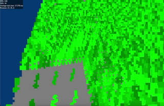

# Leafbuild
developed by thingmaker  
from Mar 17, 2024 to Aug 9, 2024

It is a micro voxel game.
The voxels can move and interact with other nearby voxels.

Waving grass demo:

Each voxel has attributes (like id and color and velocity) which can be changed and added at any time.  
There are currently 2 formats: octree and flat array.  
Octrees can also contain flat arrays at any level.  
When there are many moving voxels in a area, it automatically converts the format in the area from octree to flat array, to improve performance.  
When a flat array in an area does not have moving voxels anymore, it automatically converts it to an octree, to save memory.

It renders the world with ray casting.  
It can ray cast through octrees and flat arrays and octrees containing flat arrays.

Terrain generation is currently simple.  
First, it generates a stone layer using 2D simplex noise.  
Then, it generates some grass, with a different color for each blade of grass.

It has a server and a client.  
When a voxel changes, it stores the change, and sends it to the client soon.  
When the client receives the change, it re-uploads the data to the GPU.

It is multi-threaded.  
Each thread owns some chunks.  
On the server, when a chunk has changes, the thread that owns the chunk sends the edges of the chunk to the threads that own the neighbor chunks, to keep other threads synced.  
When a voxel moves from one chunk to another, the thread that owns the chunk sends the voxel to the thread that owns the other chunk.

I wanted leafbuild to be the best game, one that had all the good features, like high resolution voxels, water simulation, awesome terrain generated with erosion, good looking trees that had realistic branching, simulated trees growing in real time, grass and leaves that moved dynamically in the wind.

Aug 2025: When uploading this, I felt worried that I didn't include the timestamps and history of each file, but I shouldn't spend so much time preserving them.
